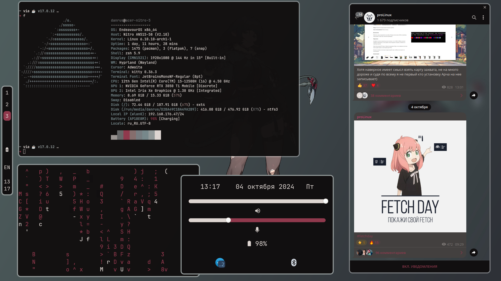

---

# dependencies:

- EWW
- SWWW
- Waybar
- Kitty
- PyWal
- zsh
- Grim
- Slurp
- cliphist 
- Hypridle
- Hyprlock
- Wofi

---

# KeyBinds:

- Super + Space = Wofi
- Super + Q = Wallpapers changer
- Super + Enter = Open Kitty
- Super + B = Hide Waybar
- Super + V = Clipboard Manager
- Super + E = EWW Status Menu
- Super + L = Hyprlock
- Caps = Change Languague
- Super + Shift + Escape = Exit Hyprland
